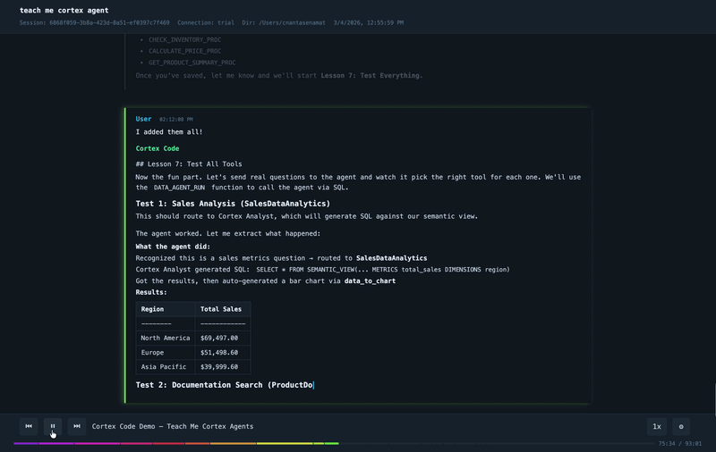

# cortex-replay

Convert [Cortex Code](https://docs.snowflake.com/en/user-guide/cortex-code/cortex-code) session transcripts into self-contained, interactive HTML replays.

Cortex Code stores full conversation transcripts as JSON files. cortex-replay turns them into visual, shareable replays — a single HTML file with no external dependencies that you can open locally, email, or embed in documentation.

Adapted from [claude-replay](https://github.com/es617/claude-replay) (MIT) for Cortex Code's session format.

**[Live Demo](https://dataprofessor.github.io/cortex-replay/)**

<a href="https://dataprofessor.github.io/cortex-replay/"></a>

## Cortex Code Skill

If you use [Cortex Code](https://docs.snowflake.com/en/user-guide/cortex-code/cortex-code), you can install cortex-replay as a skill. This lets you generate replays directly from a conversation by just asking for one, with no terminal needed.

The skill uses a bundled Python script (`skill/scripts/replay.py`) with no external dependencies. Python 3 is the only requirement.

### Install the skill

```bash
cortex skill add https://github.com/dataprofessor/cortex-replay
```

Restart Cortex Code after installing to activate the skill.

### Use the skill

Once installed, just ask Cortex Code to create a replay:

```
create a replay of my last session
```

```
replay session 6868f059 with tokyo-night theme
```

```
create a replay of turns 3-15 at 2x speed with thinking hidden
```

Cortex Code will run the bundled script, write the HTML file to your working directory, and open it automatically.

### Skill structure

```
skill/
  SKILL.md          # Skill definition loaded by Cortex Code
  scripts/
    replay.py       # Self-contained Python script (stdlib only)
```

---

## Getting Started

**Requirements:** Node.js 18+

### Install

```bash
npm install -g github:dataprofessor/cortex-replay
```

### Quick start

```bash
# List your sessions
cortex-replay --list-sessions

# Replay the most recent session
cortex-replay --last -o replay.html

# Replay a specific session (partial ID match works)
cortex-replay 6868f059-3b8 -o replay.html

# Open it
open replay.html
```

### Run without installing

```bash
npx github:dataprofessor/cortex-replay --last -o replay.html
```

## Generating a Replay

Every Cortex Code session is automatically saved as a JSON file at `~/.snowflake/cortex/conversations/`. Each file contains the full conversation history — your prompts, assistant responses, tool calls, and results. cortex-replay reads these files and produces a single HTML file you can open in any browser.

### Step 1: Find your session

List all available sessions to see IDs, titles, and timestamps:

```bash
cortex-replay --list-sessions
```

Output looks like:

```
ID            Title                                               Last Updated          Turns
----------------------------------------------------------------------------------------------
87047435-087  Chat for session: 87047435-087f-42fe-a983-afdbe...  2026-03-07T03:09:26.  9
332c040a-9c8  New coding session                                  2026-03-05T02:07:03.  14
6868f059-3b8  teach me cortex agent                               2026-03-05T01:49:56.  85
41ac248c-c8c  Generate realistic looking synthetic data in da...  2026-02-27T21:17:24.  42
...
```

Or skip this step entirely and grab the most recent session with `--last`.

### Step 2: Generate the HTML

```bash
# Most recent session
cortex-replay --last -o replay.html

# By session ID (partial match works)
cortex-replay 6868f059-3b8 -o replay.html

# By file path (if you have the JSON file directly)
cortex-replay ~/.snowflake/cortex/conversations/6868f059-3b8a-423d-8a51-ef0397c7f469.json -o replay.html
```

### Step 3: Open it

```bash
open replay.html        # macOS
xdg-open replay.html    # Linux
start replay.html       # Windows
```

The HTML file is fully self-contained — no server, no internet connection, no dependencies. Share it as an email attachment, drop it into a docs site, or commit it to a repo.

### Customizing the output

You can trim, theme, and annotate the replay in a single command:

```bash
cortex-replay --last \
  --turns 3-15 \
  --theme tokyo-night \
  --speed 2 \
  --no-thinking \
  --mark "3:Setup" \
  --mark "8:Fix bug" \
  -o replay.html
```

This generates a replay of turns 3 through 15, using the tokyo-night theme at 2x default speed, with thinking blocks hidden and chapter bookmarks at turns 3 and 8.

## Usage

```
cortex-replay <session.json> [options]
cortex-replay --last [options]
cortex-replay --list-sessions
```

### Options

| Flag | Description |
|------|-------------|
| `-o, --output FILE` | Output HTML file (default: stdout) |
| `--last` | Use the most recent session |
| `--list-sessions` | List available sessions and exit |
| `--session-dir DIR` | Session directory (default: `~/.snowflake/cortex/conversations`) |
| `--turns N-M` | Only include turns N through M |
| `--from TIMESTAMP` | Start time filter (ISO 8601) |
| `--to TIMESTAMP` | End time filter (ISO 8601) |
| `--speed N` | Initial playback speed (default: 1.0) |
| `--title TEXT` | Page title (default: from session title) |
| `--no-thinking` | Hide thinking blocks by default |
| `--no-tool-calls` | Hide tool call blocks by default |
| `--no-redact` | Disable automatic secret redaction |
| `--theme NAME` | Built-in theme (default: snowflake) |
| `--theme-file FILE` | Custom theme JSON file |
| `--mark "N:Label"` | Add a bookmark at turn N (repeatable) |
| `--bookmarks FILE` | JSON file with bookmarks `[{turn, label}]` |
| `--user-label NAME` | Label for user messages (default: User) |
| `--assistant-label NAME` | Label for assistant messages (default: Cortex Code) |
| `--no-compress` | Embed raw JSON instead of compressed |
| `--list-themes` | List available built-in themes and exit |

### Examples

See a live example at **[dataprofessor.github.io/cortex-replay](https://dataprofessor.github.io/cortex-replay/)** — an interactive replay of a Cortex Code session generated with:

```bash
cortex-replay 6868f059-3b8 --title "Building cortex-replay" --theme snowflake -o replay.html
```

More examples:

```bash
# Replay turns 3 through 10 at 2x speed
cortex-replay session.json --turns 3-10 --speed 2 -o replay.html

# Use dracula theme, hide thinking blocks
cortex-replay --last --theme dracula --no-thinking -o replay.html

# Filter by time range
cortex-replay session.json --from "2026-03-01T10:00" --to "2026-03-01T12:00" -o replay.html

# Add chapter bookmarks
cortex-replay session.json --mark "1:Setup" --mark "5:Implementation" -o replay.html
```

## Player Controls

The generated HTML is a fully self-contained interactive player:

- **Play/Pause** — auto-advances through turns block by block
- **Step forward/back** — navigate one block at a time
- **Progress bar** — click to jump to any point
- **Speed control** — 0.5x to 5x
- **Toggle checkboxes** — show/hide thinking blocks and tool calls

**Keyboard shortcuts:**

| Key | Action |
|-----|--------|
| Space / K | Play / Pause |
| Right / L | Step forward |
| Left / H | Step back |

## Themes

```bash
cortex-replay --list-themes
```

Available: `snowflake` (default), `tokyo-night`, `monokai`, `solarized-dark`, `github-light`, `dracula`.

Custom themes via JSON file:

```bash
cortex-replay session.json --theme-file my-theme.json -o replay.html
```

## Features

- **Self-contained HTML** — no external dependencies, works offline
- **Secret redaction** — API keys, tokens, passwords, and Snowflake credentials are automatically replaced with `[REDACTED]`
- **System noise filtering** — strips `<system-reminder>` blocks and internal-only content
- **Session discovery** — lists sessions, supports partial ID matching, `--last` shortcut
- **Cortex-aware tool rendering** — SQL queries, file operations, skills, and searches get contextual summaries
- **Session metadata** — displays title, Snowflake connection, working directory in the header
- **Embeddable** — drop into docs or blogs via iframe

## Embedding

```html
<iframe src="replay.html" width="100%" height="600"
  style="border: 1px solid #333; border-radius: 8px;"></iframe>
```

## Acknowledgments

Based on [claude-replay](https://github.com/es617/claude-replay) by Enrico Santagati, licensed under MIT.

## License

MIT
